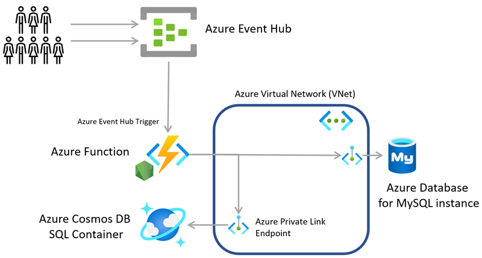

# Sample list manager application, but on Azure

This sample application processes records from an Azure Event Hub stream to create and update lists. It uses an Azure Virtual Network and Azure Private Link Endpoints as a secure inter-service transport method, giving the Azure Function access to both Azure Cosmos Database (with SQL API configured) and the Azure Database for MySQL services. The application also uses Azure Key Vault, Application Insights and GitHub Actions.

Here's how the services map between AWS and Azure.

| Azure | AWS |
|----|----|
| Cosmos DB | DynamoDB |
| Event Hub | Kinesis |
| Functions | Lambda |
| Database for MySQL | RDS (MySQL) |
| Application Insights | X-Ray |
| Key Vault | Secrets Manager |
| GitHub Actions | CodeDeploy |
| Virtual Network | VPC |
| Private Link Endpoint | VPC endpoint |

There are some functional differences between services which we'll take a look at later. We also have multiple methods to deploy code into Azure, but for the purpose of simplicity we are using GitHub Actions here as the deployment definition lives with this sample, making much more straightforward to clone and get started.

## Data flow

The Azure Function is triggered by new events arriving within the Azure Event Hub. In our sample application the sample client-app is used to create these events and sent them in a batch.

The Azure Function Event Hub binding is using the default settings for batch size so one or more events will be received and processed by the Node.js code of the Azure Function.

The processed data is then persisted to both the Azure Database for MySQL instance and the Cosmos DB Container. We have collapsed the two tables used in the original sample as the use of individual Containers to represent Tables in Cosmos DB is an anti-pattern.

## Functionality (Ranking and Stats)

The behaviour of this solution is exactly the same as that described in the [original implementation](https://github.com/awsdocs/aws-lambda-developer-guide/tree/main/sample-apps/list-manager).

## Prerequisites

This sample application is compatible with [LTS versions of Node.js](https://nodejs.org/about/releases/).

You need an Azure subscription to deploy this solution.